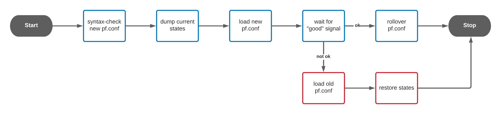
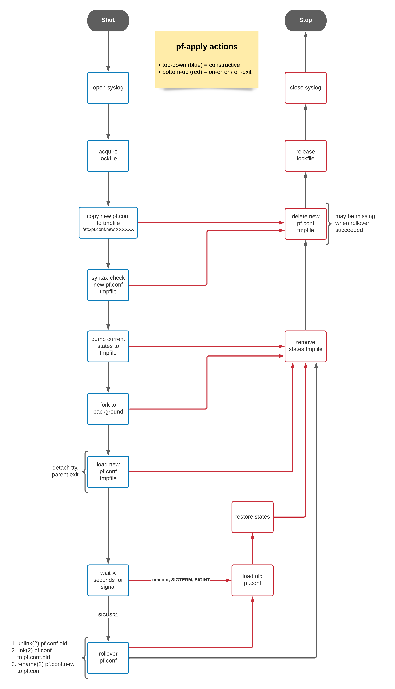

**WARNING:** At present, this project is vaporware ;-) No code has been written yet.

# Introduction

*pf-apply* loads a new pf.conf configuration file and waits for user feedback.

Only if the user accepts the new configuration within a specific time frame (default: 30 seconds),
it gets installed to ``/etc/pf.conf`` and will be active on the next boot as well.

Otherwise, the configuration gets rolled back to the previous rule set.

The typical scenario is updating the pf.conf on a remote machine via SSH
while avoiding to get locked out.


# Usage

**WARNING:** At present, this project is vaporware ;-) No code has been written yet.

Upload a new pf.conf to a remote host:

```sh
# Upload new pf.conf (scp, sftp, rsync, ...)
scp local.pf.conf remote-host:./pf.conf.new

# Load new pf.conf
ssh remote-host pf-apply -f ./pf.conf.new || exit

# Terminate any local SSH session multiplexing
# to ensure that the next ssh invocation uses a new connection
# and does not bypass the firewall due to existing states.
ssh -O exit remote-host

# Connect to the remote host via SSH and accept the new pf.conf
ssh remote-host pkill -SIGUSR1 pf-apply
# or ssh remote-host kill -SIGUSR1 <PID>
```


## pf-apply Process

### Basic Process Overview



### Process Description

#. Initialize logging

#. Block other instances by acquiring an advisory file lock (``flock(2)``)

#. Copy the new pf.conf to a temporary file below ``/etc``
   so that it can be atomically moved later on

#. Check the new pf.conf (using ``pfctl -n -f pf.conf.new``)

#. Dump current states for recovery on error

#. Fork to background, detach tty and exit parent process

   The parent process writes the pid of the child process
   to stdout prior to exiting.

#. Load the new pf.conf file

#. Wait up to 30 seconds for user feedback
   whether the new configuration should be kept or not.

   To accept the new configuration, send *SIGUSR1* to the process.

   To discard it and roll back, send *SIGTERM* or *SIGINT*.
   Alternatively, this option is also selected if no user feedback
   was received at all, usually caused by being locked
   out by the new firewall configuration.

#. User accepts the new configuration (*SIGUSR1* received)

   Rotate pf.conf files so that the new pf.conf configuration
   will be used on next boot:

   * ``/etc/pf.conf`` is moved to ``/etc/pf.conf.old``
   * The new configuration is moved to ``/etc/pf.conf``

   This step uses hardlinks to ensure a mostly atomic operation.

#. User does not accept the new configuration (timeout or *SIGTERM/SIGINT* received)

   * Load ``/etc/pf.conf``

   * Restore firewall states from the previously created temporary file

   Alternatively, disable the firewall altogether (``-d`` option).

#. Clean up temporary files, stop logging


### Detailed Process Overview




# LIMITATIONS

pf-apply will restore the configuration from ``/etc/pf.conf`` on error.
Previous rules stored in dynamic anchors or loaded from other files will be discarded.

No attempt is made to freeze tables, previous entries may be lost.
In particular, changed table files (``table <foo> file "file-path"``) will affect the restored configuration.


# BUGS

Please report bugs at <https://github.com/dywisor/pf-apply/issues>
